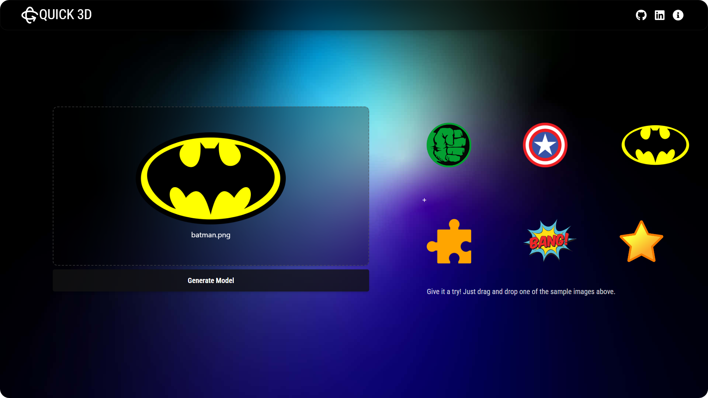
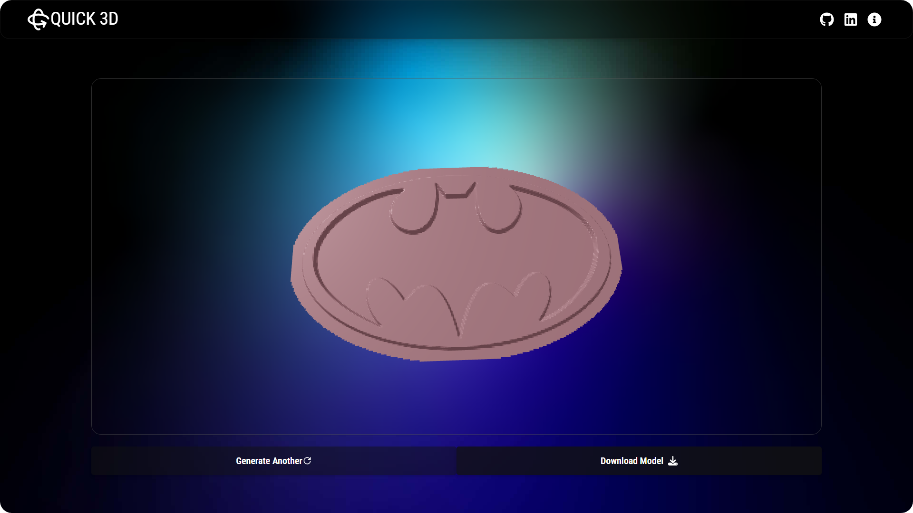
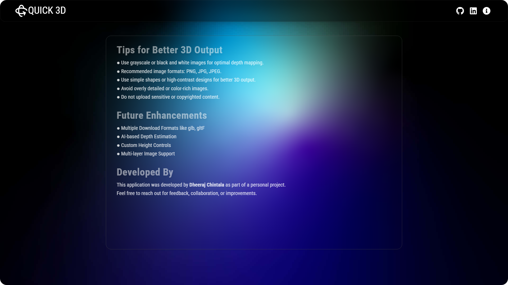

# Quick 3D

</img>  

Quick 3D is a React-based web application that allows users to seamlessly convert 2D images (like PNG or JPG) into 3D STL (stereolithography) models. The app leverages image processing techniques to generate heightmaps or depth-based models from grayscale images, which are then transformed into downloadable STL files suitable for 3D printing or modeling.

  
  
  

---
## Key Features

- **Image Upload:** Upload PNG, JPG, or JPEG images from your device.
- **Depth Mapping:** Converts grayscale or monochrome images into 3D height-based meshes.
- **STL Export:** Download the 3D model as a standard STL file.
- **Preview Viewer:** View and rotate the generated 3D model in real-time before downloading.

  ## Screenshots

</img>
</img>
</img>

##  Built With

- [React](https://reactjs.org/)
- [Vite](https://vitejs.dev/)
- [Three.js](https://threejs.org/) – for 3D model rendering
- [Tailwind CSS](https://tailwindcss.com/) – for styling
- [Python Fast API](https://fastapi.tiangolo.com/)
- [Axios](https://axios-http.com/) – for API requests

  
## Future Enhancements

- Multiple Download Formats like glb, glTF
  
- AI-based Depth Estimation

- In-browser Model Editor

- Custom Height Controls

- Multi-layer Image Support

##  Live Demo 

🔗 **Visit here**: [Quick-3D Live Site](https://quick3d.vercel.app)

