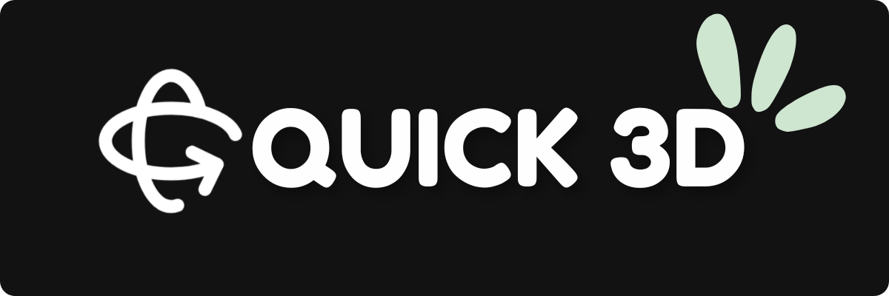
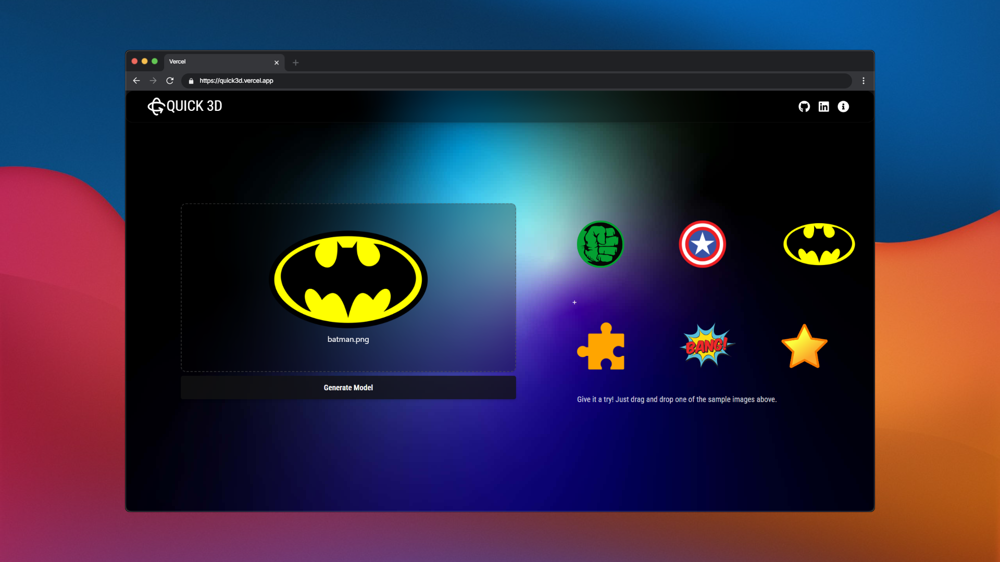
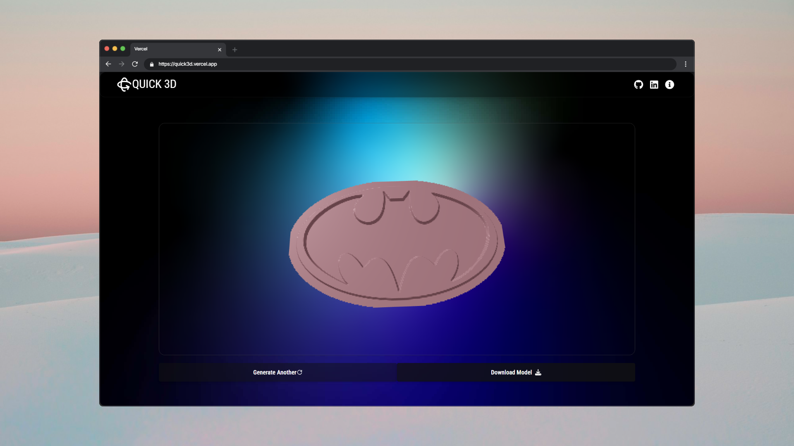
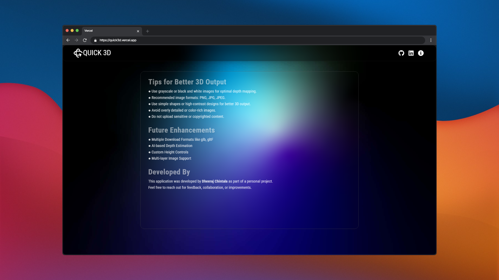

# Quick 3D


</img>  


Quick 3D is a React-based web application that allows users to seamlessly convert 2D images (like PNG or JPG) into 3D STL (stereolithography) models. The app leverages image processing techniques to generate heightmaps or depth-based models from grayscale images, which are then transformed into downloadable STL files suitable for 3D printing or modeling.

<p align="center">
  <a href="https://quick3d.vercel.app">
    
  </a>
  <a href="https://quick3d.vercel.app">
    
  </a>
  <a href="https://hub.docker.com/r/dheerajchintala/quick3d">
    
  </a>
</p>


---
## Key Features

- **Image Upload:** Upload PNG, JPG, or JPEG images from your device.
- **Depth Mapping:** Converts grayscale or monochrome images into 3D height-based meshes.
- **STL Export:** Download the 3D model as a standard STL file.
- **Preview Viewer:** View and rotate the generated 3D model in real-time before downloading.


  ## Screenshots

</img>
</img>

<details>
<summary>More screenshots</summary>
  </img>

</details>


##  Built With

| Category     | Tech                     |
|--------------|---------------------------|
| Frontend     | ReactJS, Vite, ThreeJS   |
| Styling      | Tailwind CSS             |
| Backend      | Python FastAPI           |
| Communication| Axios                    |

  
## Future Enhancements

- Multiple Download Formats like glb, glTF
  
- AI-based Depth Estimation

- In-browser Model Editor

- Custom Height Controls

- Multi-layer Image Support

##  Deployment

This project is deployed in two ways:


###  1. Live Deployment (Vercel)
The production build is hosted on **Vercel** for fast, globally distributed static hosting.

🔗 **Live URL:** https://quick3d.vercel.app/


###  2. Docker Deployment (Nginx + Docker)
A production-ready Docker image is available on Docker Hub.  
It includes a multi-stage build (Node → Nginx) with optimized static assets.

#### Pull the Docker Image
```bash
docker pull dheerajchintala/quick3d:latest
```
#### Run the container
``` bash
docker run -p 3000:80 dheerajchintala/quick3d
```
#### Now open http://localhost:3000


